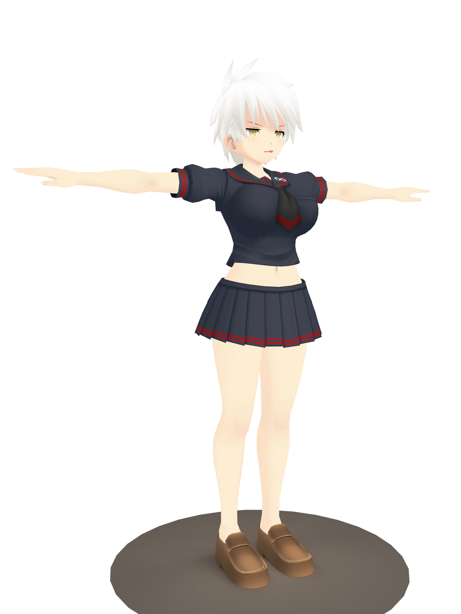

# SenranKaguraToolkit

Some sort of Middleware to work with Files from the PC Version of 'Senran Kagura - Shinovi Versus and Estival Versus'.  

For Informations regarding the File-Formats see the [Wiki](https://github.com/berndt-simon/SenranKaguraToolkit/wiki)

The Middleware itself is in a _very very_ early Stage.

## Shinovi Versus

Things that work at the Moment:
* Generate a List of all Files from filename.bin
* Read Content of CAT-Files
* Read Content of GXT-Files (standalone or within a CAT-File)
* Dump GXT-Content as DDS-Files - replicating internal File-Structure with new Folders
* Read Content of TMD-Files (standalone or within a CAT-File)
* Dump TMD-Content as OBJ-Files - Vertex/Normals/UVs within obj, Materials as *.mtl Reference  
 OBJ does not support Bones/Rigging but the nessecary Data is already available.
* Dump TMD-Content as DAE-Files - Using Assimp [WIP]
* View Content of .CAT Files (Images and 3D-Models) using a separate Viewer Application
 Open Files by drag-over-exe or using Filename as Start-Parameter
 To view 3D-Models with Textures also provide relevant Texture-CAT-File

I dared to require Boost::Filesystem because working without it would be a mess.  
To build the Toolkit [Assimp](http://www.assimp.org/) is required.  
To build the Viewer the [libSBGLpp Library](https://github.com/berndt-simon/libSBGLpp) is required.

## Estival Versus

Things that work at the Moment:
* Unpack CAT-Files

As an Example - Character exported as OBJ - Rendered with Blender

